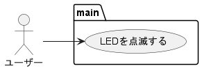
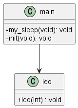
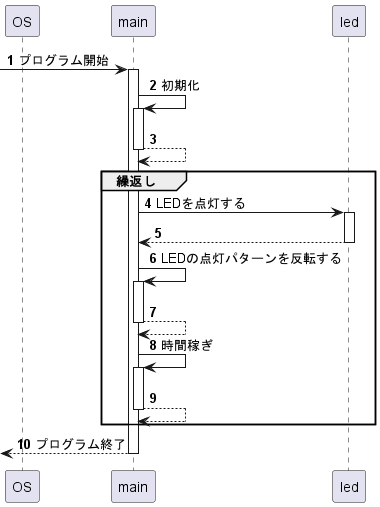
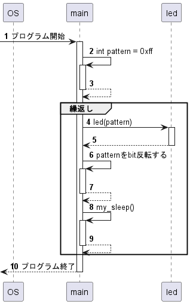

# UML設計図の読み方サンプル

# 接続
端子接続を以下に示す。


## LED
- PB0からPB7にLED 端子を接続

# 機能



図\ref{zu:ユースケース図}を上から順に説明する。
<!-- LaTeX \clearpage -->

## LEDを点滅する
動作中、LEDが点滅する。


# 設計

## モジュール関連図（クラス図）

<!-- LaTeX \setfgsize{0.95} -->  


<!-- LaTeX \clearpage -->

## PAD図
[動作詳細を示したpad図](PAD/pad.pdf)

## 手順図（シーケンス図）

### 抽象的な記述例


### 具体的な記述例



# 実装
最終的に実装されたコードは下記のとおりである。
## メインモジュール(main.c)
```c
/**
 * @file h8sample.c
 * @brief h8モーターを回転するプログラム
 * @author Yuji KATSUTA, Makoto TANABE
 * @date 2022.4.22
 */
#include <stdlib.h>
#include<h8/reg3067.h>
#include<mes2.h>	
#include <stdlib.h>

// 時間稼ぎ
void my_sleep(void){
  int i;
  for(i = 0; i < 10000; i++){
    // do nothing
  }
}


// 初期化
static void init(void)
{
  // LED
  PBDDR = 0xff; //ポートBを出力用に設定（0〜7）
  PBDR = 0xff;  //全LED消灯
  return;
}

int main(int argc, char **argv)
{
  int pattern = 0xff; //11111111;
  init();

  while (1)
  {
      led(pattern); // LEDを点灯
      pattern = ~pattern; // LEDの点灯パターンを反転
      my_sleep(); // 時間稼ぎ
  }
  // ここには来ない
  return 0;
}
```


