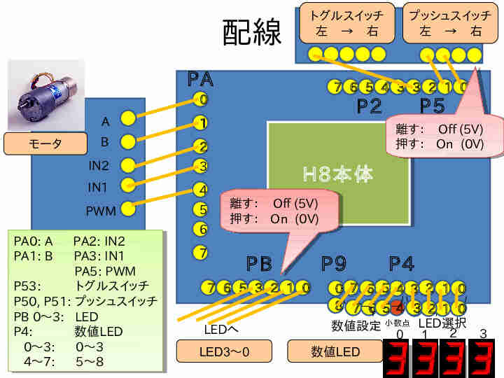
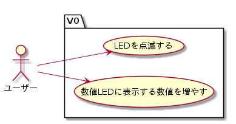
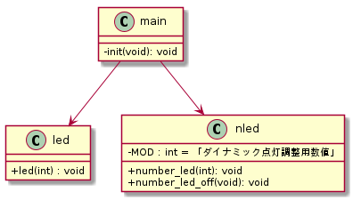
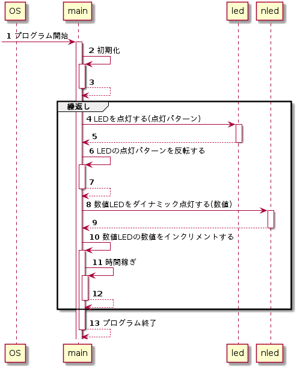
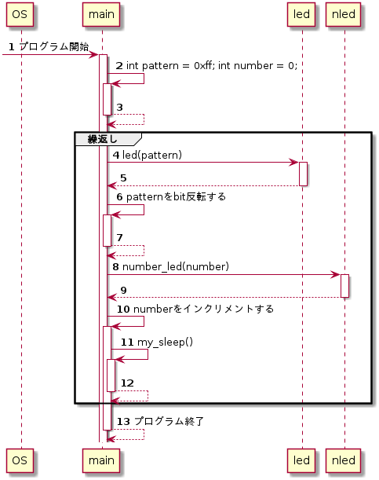

# UML設計図の読み方サンプル

# 接続
端子接続を以下に示す。

## LED
- PB0からPB7にLED 端子を接続

## 数値LED
- P40からP47に数値LED端子を接続

# 機能

上から順に説明する。

## LEDを点滅する
動作中、LEDが点滅する。

## 数値LEDに表示する数値を増やす
数値LEDに4桁の数値をダイナミック点灯する。初期値が0で、動作中数値が増加する。9999を越えると0に戻る。

# 設計

## モジュール関連図（クラス図）

<!-- LaTeX \setfgsize{0.95} -->  

<!-- LaTeX \clearpage -->

## PAD図
[動作詳細を示したpad図](PAD/pad.pdf)

## 手順図（シーケンス図）

### 抽象的な記述例

### 具体的な記述例

# 実装(課題)

この設計に対応するプログラムを実装せよ。

